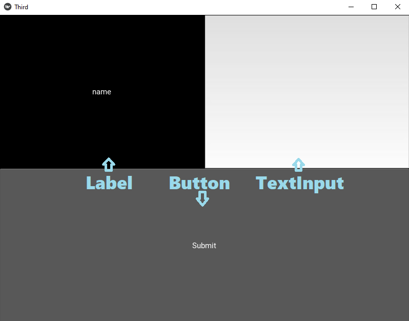
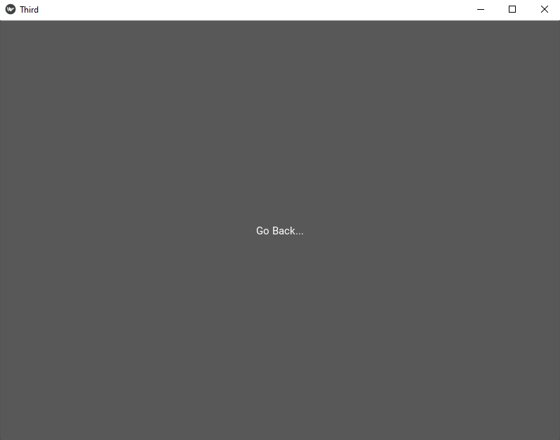
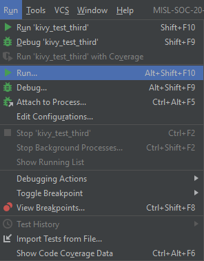
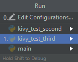

# Description of Tests

All dependencies can be installed by:
- Opening a Command Prompt window.
- Using Anaconda to activate your virtual environment *(See README.md in main directory)*.
- Typing "pip install {package}" replacing {package} with whatever dependency you are installing.

## Third Kivy Example

- This is an example of using kivy to have multiple screens on one app and basic TextInput and Labels.

### How it Works

- This example has two components: kivy_third_test.py and third.kv.

	- kivy_third_test.py
		- Instantiates two separate screens
		- Instantiates the "manager" for those screens
		- Loads third.kv
		- Runs the application
		
	- third.kv
		- Associates the two separate screens as children of the screen manager
		- Defines the layout of the main screen
			- Label "Name" with text input beside it
			- Button to transition to the second screen
		
		- Defines the layout of the second screen
			- Just a button to transition back to the main screen
			
		
		

### How to install and run
- The dependencies you need to install *(see top for instructions)* before running are:
	- Kivy
	
- To run the app on PyCharm:
	- Have "kivy_third_test.py" as your main window.
	- Click "Run" in the toolbar.
	- Click "Run" from the dropdown menu.
	- Click "kivy_third_test.py" from the menu that appears.
	
	
	

## OpenCV Video Test Example

- This is an example of using OpenCV image manipulation capabilities while capturing video from your screen.

### How it Works

- This example has only one component: video_test.py
    
    - First, it grabs a screenshot of your entire screen. It then converts it to a Numpy array because OpenCV only works with numpy arrays.
    - Then it applies a black-and-white filter to that image.
    - Finally, it displays the image in a window.
    - It will loop through this until the "q" key is pressed.
    
    This effect can occur if the frame is fullscreen and on your main monitor.
    
	
### How to install and run
- The dependencies you need to install *(see top for instructions)* before running are:
	- OpenCV
	- Numpy
	- Pillow (PIL)
	
- To run the app on PyCharm:
	- Refer to the guide above for similar example.